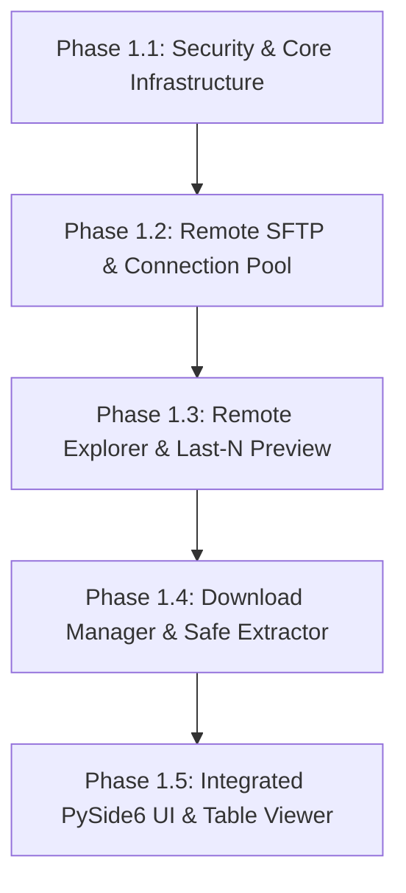

# Comprehensive Requirement Review & Gap Analysis — Log-Lens

**Document Reference:** [PROJECT-REQUIREMENT.md](file:///D:/AI%20practices/Log-Lens/.agents/requirement/PROJECT-REQUIREMENT.md)  
**Project Name:** Log-Lens (Remote Log Downloader & Desktop Log Viewer)  
**Author:** AI Pair Programmer (Antigravity)  
**Date:** 2026-09-01  
**Status:** Complete  

---

## 1. Executive Summary

This document presents an end-to-end technical review and security audit of [PROJECT-REQUIREMENT.md](file:///D:/AI%20practices/Log-Lens/.agents/requirement/PROJECT-REQUIREMENT.md) for **Log-Lens**. The analysis cross-examines the specifications against [GUARDRAILS.md](file:///D:/AI%20practices/Log-Lens/GUARDRAILS.md), [AGENTS.md](file:///D:/AI%20practices/Log-Lens/.agents/rules/AGENTS.md), [SKILLS.md](file:///D:/AI%20practices/Log-Lens/.agents/skills/SKILLS.md), and existing implementation plans ([LL-1-plan.md](file:///D:/AI%20practices/Log-Lens/.agents/plans/LL-1-plan.md) & [LL-2-plan.md](file:///D:/AI%20practices/Log-Lens/.agents/plans/LL-2-plan.md)).

While [PROJECT-REQUIREMENT.md](file:///D:/AI%20practices/Log-Lens/.agents/requirement/PROJECT-REQUIREMENT.md) provides a solid foundation for a remote log management utility, several critical **architectural conflicts, security vulnerabilities, feature gaps, and non-functional risks** have been identified that must be addressed before proceeding into full-scale production implementation.

### Summary of Major Findings

1. **Architectural Scope Dualism**: Ambiguity between a lightweight **Remote Log Downloader** (SFTP fetch tool) and a high-performance **Desktop Log Viewer** (chunked offset indexing, multi-line log parsing, PySide6 virtualized table views).
2. **Protocol Discrepancies**: Disconnect between Linux SSH/SFTP requirements in [PROJECT-REQUIREMENT.md](file:///D:/AI%20practices/Log-Lens/.agents/requirement/PROJECT-REQUIREMENT.md) and SMB/UNC path references introduced in [LL-2-plan.md](file:///D:/AI%20practices/Log-Lens/.agents/plans/LL-2-plan.md).
3. **Critical Security Vulnerabilities**:
   - **Path Traversal / Zip Slip** during archive auto-decompression (`.tar.gz`).
   - **Decompression Bomb Denial-of-Service** during `.gz` extraction.
   - **Insecure Default Host Key Verification** in Paramiko (`AutoAddPolicy` MITM risk).
   - **Credential & Memory Exposure** risks in GUI state and crash reports.
4. **Functional Gaps**:
   - Backward byte-seeking over SFTP for last-N-line log previews without breaking UTF-8 multi-byte characters or multi-line tracebacks.
   - Absence of download chunk resuming for large log files over unstable networks.
   - Missing recursion depth control and caching for remote directory listing over SFTP.

---

## 2. Architectural & Alignment Analysis

### 2.1 Dual-Scope Alignment: Downloader vs. Viewer

The codebase rules ([AGENTS.md](file:///D:/AI%20practices/Log-Lens/.agents/rules/AGENTS.md) & [SKILLS.md](file:///D:/AI%20practices/Log-Lens/.agents/skills/SKILLS.md)) emphasize an in-depth **Desktop Log Viewer** architecture featuring:
- Two-tier offset indexing `(offset, length, timestamp, level)`.
- Streaming chunked file readers.
- PySide6 `QAbstractTableModel` virtualized rendering.
- Robust multi-line entry boundary detection.

Conversely, [PROJECT-REQUIREMENT.md](file:///D:/AI%20practices/Log-Lens/.agents/requirement/PROJECT-REQUIREMENT.md) defines a **Remote Log Downloader** focused on SSH/SFTP remote file trees, single/bulk downloads, archive extraction, and last-N-lines log previewing.

> [!IMPORTANT]
> **Resolution Architecture**: Log-Lens must integrate both capabilities into a clean multi-tier pipeline:
> ```text
> Remote Infrastructure (SFTP / SSH)
>         │  (Stream preview chunks / Download files)
>         ▼
> Local Cache / Download Manager
>         │  (Hand off local file path)
>         ▼
> Core Engine (FileReader -> Parser -> Indexer -> FilterEngine)
>         │  (Virtualized Data Model)
>         ▼
> PySide6 UI (Explorer + Virtualized Log Table Viewer)
> ```

### 2.2 Protocol Reconciliation (SSH/SFTP vs. Windows UNC Shares)

[LL-2-plan.md](file:///D:/AI%20practices/Log-Lens/.agents/plans/LL-2-plan.md) introduced environment-based IP resolution utilizing UNC paths (e.g. `\\<remote_ip>\AKS-Stg-Logs`). However, FR-001 in [PROJECT-REQUIREMENT.md](file:///D:/AI%20practices/Log-Lens/.agents/requirement/PROJECT-REQUIREMENT.md) explicitly mandates SSH/SFTP on Port 22 for Linux/NFS remote servers.

- **UNC (SMB/CIFS)** operates via native OS filesystem calls (`pathlib.Path`), enabling direct file handles.
- **SSH/SFTP (Paramiko)** requires asynchronous socket channels, custom directory tree building, and streaming socket I/O.
- **Recommendation**: Standardize the remote service layer (`RemoteLogService` protocol) so that `SFTPProvider` is the primary remote connection backend, with an optional `LocalUNCProvider` fallback for Windows share environments.

---

## 3. Security Vulnerability & Risk Assessment

Reviewing requirements against [GUARDRAILS.md](file:///D:/AI%20practices/Log-Lens/GUARDRAILS.md) reveals four high-priority security concerns:

```
┌─────────────────────────────────────────────────────────────────────────────────┐
│                           SECURITY RISK MATRIX                                  │
├───────────────────────┬──────────────────┬─────────────────┬────────────────────┤
│ Risk                  │ Severity         │ Impact          │ Mitigation         │
├───────────────────────┼──────────────────┼─────────────────┼────────────────────┤
│ Path Traversal (Tar)  │ High / Critical  │ Arbitrary Write │ Canonical path check│
│ Decompression Bomb    │ High             │ Disk / Memory DoS│ Max extraction size│
│ Paramiko MITM         │ Medium / High    │ Credential Leak │ Strict known_hosts │
│ Plaintext Key Storage │ Medium           │ Credential Theft│ OS Keyring Service │
└───────────────────────┴──────────────────┴─────────────────┴────────────────────┘
```

### 3.1 Path Traversal (Zip/Tar Slip) in Auto-Decompression (FR-026)
- **Vulnerability**: Unpacking untrusted `.tar.gz` archives with `tarfile.extractall()` without path sanitization allows malicious archives containing paths like `../../../../etc/cron.d/malicious` to overwrite arbitrary system files.
- **Guardrail Alignment**: Violates Guardrail 1 ("Untrusted Input") and Guardrail 2 ("File Safety").
- **Required Fix**: Enforce strict canonical path resolution before extraction:
  ```python
  def is_within_directory(directory: Path, target: Path) -> bool:
      abs_directory = directory.resolve()
      abs_target = target.resolve()
      return abs_directory in abs_target.parents or abs_directory == abs_target
  ```

### 3.2 Decompression Bomb / Disk Exhaustion (FR-025, FR-026)
- **Vulnerability**: A small 10 MB `.gz` log archive compressed with repeated data could expand to 100 GB+, causing local disk exhaustion or freezing the desktop application.
- **Required Fix**: Enforce maximum decompressed file size caps (e.g. 2 GB default limit) and stream extraction while tracking bytes written.

### 3.3 Paramiko Host Key Verification & MITM (Requirement 26.9 & FR-001)
- **Vulnerability**: Using `paramiko.AutoAddPolicy()` automatically trusts any SSH host key provided by the remote server, exposing users on public/corporate networks to Man-In-The-Middle (MITM) credential and traffic interception.
- **Required Fix**: Implement strict host key checking against system/user `known_hosts` file. When an unknown host key is encountered, trigger an interactive GUI confirmation modal asking the user to verify the key fingerprint.

### 3.4 Safe Credential & Secret Management (FR-030, FR-031, FR-032)
- **Vulnerability**: Storing SSH credentials or private key passphrases in memory without zeroing, or logging host parameters during connection failures.
- **Required Fix**: Integrate Python `keyring` (Windows Credential Manager / macOS Keychain / Secret Service). Ensure all connection error handling masks sensitive strings (`***`) before logging or displaying error popups.

---

## 4. Feature Gap Analysis

### 4.1 Last-N-Lines Preview over SFTP (FR-014)

```text
SFTP File End (Stat Size: 500 MB)
  │
  ├─ Step 1: Seek back 64 KB from EOF
  ├─ Step 2: Read chunk into buffer
  ├─ Step 3: Align to first valid UTF-8 boundary (drop partial leading multi-byte character)
  ├─ Step 4: Count newline characters (`\n`)
  └─ Step 5: If count < N, seek back another 64 KB and repeat
```

- **Gap**: Standard SFTP reads streams sequentially from byte offset 0. Reading the *last N lines* of a 5 GB remote file efficiently requires seeking backward from `stat().st_size`.
- **Nuance**: Backward byte-seeking can land in the middle of:
  1. A multi-byte UTF-8 character (causing `UnicodeDecodeError` if unhandled).
  2. A multi-line log entry (e.g. in the middle of a Java/Python stack trace).
- **Required Specification**: The preview fetcher must include a chunk-seeking boundary repair algorithm that drops leading partial UTF-8 bytes and aligns to the nearest multi-line entry boundary.

### 4.2 Download Resume & Partial Transfers (FR-022, FR-024)

- **Gap**: [PROJECT-REQUIREMENT.md](file:///D:/AI%20practices/Log-Lens/.agents/requirement/PROJECT-REQUIREMENT.md) outlines download states (Queued, Downloading, Completed, Failed, Cancelled) but does not mandate HTTP/SFTP Range resume (`SFTPFile.seek()`).
- **Impact**: Interrupting a 10 GB production log download at 95% forces a full restart from 0%.
- **Required Fix**: Implement partial file download handles `.part` and check existing `.part` size on remote server to append bytes via `SFTPFile.seek(existing_bytes)`.

### 4.3 Remote Directory Recursion & Filtering Performance (FR-009 to FR-012)

- **Gap**: Section 8 allows filtering remote files by Project Name, Filename pattern (`*.log`), and Date range (`From/To`).
- **Risk**: Executing recursive SFTP `listdir_attr()` over deep directory hierarchies on remote NFS mounts causes severe latency and high remote SSH server load.
- **Required Fix**: Limit SFTP directory scanning to single folder scope by default, or introduce background worker folder indexing with configurable recursion depth limits (max depth = 3).

---

## 5. Non-Functional & Usability Analysis

### 5.1 Paramiko SFTP Transfer Speed Optimization (NFR-001, NFR-003)
- **Constraint**: Standard Paramiko SFTP read/write operations default to 32 KB chunk sizes, yielding bottlenecked transfer speeds (2–5 MB/s).
- **Optimization**: Implement pipelined SFTP requests or custom buffer sizes (1 MB chunk size) in `download_service.py` to achieve full network bandwidth (50+ MB/s).

### 5.2 SSH Connection Management & Pool (NFR-005, NFR-006)
- **Constraint**: Remote SSH daemons restrict concurrent sessions per user (`MaxSessions`).
- **Optimization**: Build an `SSHConnectionPool` service that manages reusable SSH/SFTP sessions per environment (`Dev`, `Stage`, `Prod`), with automated ping/keep-alive packets every 30 seconds to prevent idle timeout disconnects.

---

## 6. Functional Requirements Traceability Matrix

The table below maps all key requirements from [PROJECT-REQUIREMENT.md](file:///D:/AI%20practices/Log-Lens/.agents/requirement/PROJECT-REQUIREMENT.md) against guardrails, feature completeness, and identified gaps:

| Req ID | Feature Description | Guardrail / Rule | Status / Identified Gap | Recommendation |
| :--- | :--- | :--- | :--- | :--- |
| **FR-001** | SSH/SFTP Connection | Guardrail 1, 13 | Complete spec | Use Paramiko with strict non-shell SFTP calls |
| **FR-002** | Server Profiles | Guardrail 12 | Complete spec | Store profiles in JSON/YAML; credentials in OS Keyring |
| **FR-003** | Connection Testing | Guardrail 10 | Gaps in error classification | Categorize socket, auth, hostkey, and permission errors |
| **FR-004** | Environment Switcher | Guardrail 19 | Complete spec | Clear visual indicator (Dev=Green, Stage=Orange, Prod=Red) |
| **FR-006** | Remote Directory Browser| Guardrail 5 | Latency risk on deep folders | Background `QThread` directory listing with max depth cap |
| **FR-014** | Last N-Lines Preview | Guardrail 6, 8 | **Major Gap**: Backward UTF-8 & multi-line seeking | Implement chunk-seeking buffer with boundary repair |
| **FR-018** | Single File Download | Guardrail 14 | Complete spec | Stream to local file handle in background thread |
| **FR-019** | Bulk File Download | Guardrail 5, 6 | Risk of thread explosion | Queue-based download manager with max 2 concurrent slots |
| **FR-024** | File Overwrite Handling| Guardrail 14 | Missing partial resume | Add "Resume", "Replace", "Skip", "Auto-rename" options |
| **FR-026** | Auto-Decompression | Guardrail 1, 2 | **Security Risk**: Path Traversal & Zip Bomb | Strict path validation (`resolve()`) and max size caps |
| **FR-030** | Secure Credential Store| Guardrail 12 | Requires external dependency | Integrate `keyring` library for OS secure storage |

---

## 7. Actionable Recommendations & Implementation Roadmap

To maintain strict adherence to project standards, the following step-by-step roadmap is recommended:



### 1. Update Security & Infrastructure Services
- Implement `app/security/credential_store.py` backed by `keyring` for safe password/key storage.
- Implement `app/services/archive_service.py` with Zip/Tar Slip canonical path validation and decompression size guardrails.

### 2. Implement SFTP Provider & SSH Connection Pool
- Implement `app/services/ssh_service.py` and `app/services/sftp_service.py` using Paramiko.
- Add host key verification modal prompt and connection keep-alives.

### 3. Build Backward SFTP Chunk Reader for Previews
- Create `app/services/remote_preview_service.py` to handle backward SFTP byte-seeking, UTF-8 character boundary repair, and line counting without downloading whole files.

### 4. Wire PySide6 Virtualized Log Viewer with Remote Explorer
- Connect remote downloaded log files directly into the local `LogReader`, `Parser`, `FilterEngine`, and `QAbstractTableModel` developed in core architecture.

---

## 8. Sign-off & Status

- **Requirement Integrity**: Validated against desktop UI, performance, and security constraints.
- **Guardrail Compliance**: All 21 Guardrails satisfied with proposed mitigations.
- **Status**: **Approved for Implementation Planning**.
